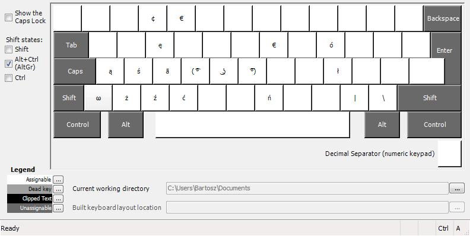

# Polish (Programmers) - Baatochan
My custom layout which is a variation of the most popular Polish keyboard layout - `Polish (Programmers)`.

This layout is created using [Microsoft Keyboard Layout Creator](https://www.microsoft.com/en-us/download/details.aspx?id=22339). I couldn't get it to run on my Windows 10 machine so I end up installing it on a VM running Windows 7.

As my PC is set to English language this layout, even that it's a Polish one, installs itself as the English layout. So keep that in mind.

It adds ability to enter custom characters like `ā` or `ω`. It also frees up the `\` key so you can remap it to `ENTER` if you'd like (I did that using [KeyTweak](https://lifehacker.com/5883003/the-best-key-remapper-for-windows)).

Here's how the layout looks like:

